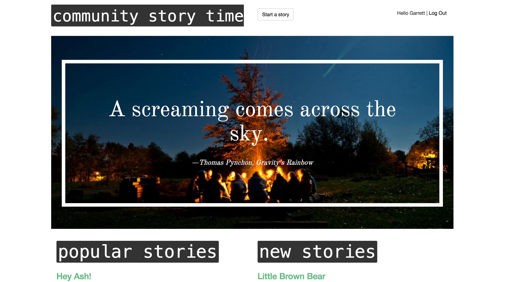
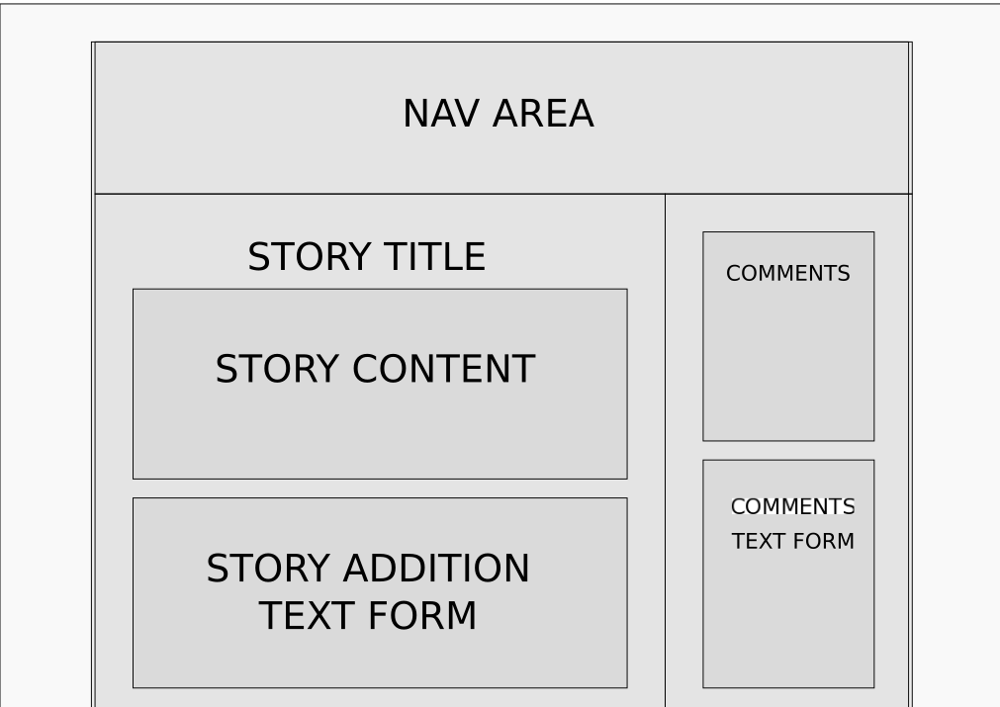

# Community Store Time

### A rails based web app that allows people to collaborate on stories.

At community story time, users can start stories, continue previously started stories and make comments on stories.  

## To use the app

Visit [community story time ](st.garrettestrin.com )to use the app as a user.

Visit [commnity_story_time github repository ](https://github.com/GarrettEstrin/story_time) to download the app to your local machine.

This app was built with Ruby 2.3.1.

### Local installation instructions

Download the repository to your preferred directory.

 Start a Posgres local server.

 From the terminal and in your installation directory run

 `bundle install`

 to install the dependent gems.

 Create the database by running

 `rake db:create`.

 Create the database tables by running

 `rake db:migrate`

 from the terminal.

 Create at least five stories from the rails console before launching the site or errors will occur.

 In the terminal in your installation directory, run

 `rails console`

 to enter the rails console.

 In the rails console, run

 `Story.create({title: "Story Example", content:"This is the body of the story", user_id:1})`

 five times to generate five sample stories with user_id of 1.  A bug exists that requires five or more stories to be in the database to generate the home page.

 In the rails console, run

 `User.create({name:"User", email:"mail@mail.com"})`

 to create the first user that will be the owner of the example stories.

 In the rails console, run

 `exit`

 to exit the rails console, then start the rails server by running

 `rails server`

 in the terminal.

 User your web browser to go to

 [localhost:3000 ](localhost:3000)

 to use the site locally.

### Development process

Technologies used: HTML / CSS + Bootstrap / Javascript + jQuery / Ruby + Ruby on Rails / Postgres

The app was generated using ruby on rails.

## User Stories

As a user, I can register a new account with minimal information.

As a user, I can login without leaving the home page.

As a user, I can post the beginning to a story.

As a user, I can browse the stories newest and by most popular.

As a user, I can continue stories started by other users.

As a user, I can logout out of the website from any page.

## Future implementations

* Search for stories by keyword.

* Like system.

* Fix errors related to having less than five stories in database.

* Deployment Instructions in this README

## Feature Wish List

* Story history's

* Edit stories by clicking on desired paragraph
